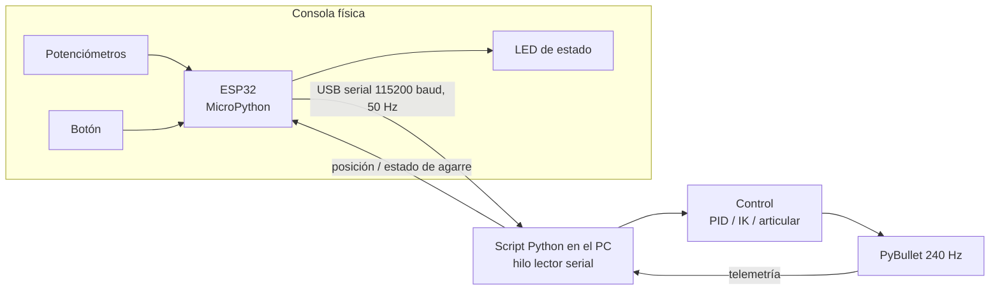

# Taller Segundo Corte — Real-to-Sim con ESP32 y PyBullet

**Asignatura:** Microcontroladores y Laboratorio — Grupo MEC C (Cajicá) 2026-02
**Universidad Militar Nueva Granada** — Ingeniería Mecatrónica
**Autor:** Bryan Andrey Martínez Montaño

---

## 1. Descripción

En este taller se construyó una **consola de mandos física con una ESP32 programada en MicroPython** que controla en tiempo real robots simulados en **PyBullet** (enfoque *real-to-sim*: el operador actúa sobre hardware real y el efecto se ve en la simulación).

| Punto | Robot | Repositorio base | Hardware de la consola | Tipo de control |
|---|---|---|---|---|
| **A** | Dron Crazyflie CF2X | [gym-pybullet-drones](https://github.com/utiasDSL/gym-pybullet-drones) | 1 botón | Misión de posición A → B gestionada por la ESP32 |
| **B** | Baxter | [pybullet_robots](https://github.com/erwincoumans/pybullet_robots) (`baxter_ik_demo.py`) | 3 potenciómetros + 1 botón | Cartesiano con cinemática inversa y agarre de objetos |
| **C** | Atlas (Boston Dynamics) | [pybullet_robots](https://github.com/erwincoumans/pybullet_robots/tree/master) / `pybullet_data` | 3 potenciómetros + 1 botón | Articular (articulación por articulación) con cámaras sintéticas |

**Videos de la práctica:** [Punto A](https://youtu.be/QLwVitDZYSo) · [Punto B](https://youtu.be/jT_P3yOoTqY) · [Punto C](https://youtu.be/0XOJdthhI4s) (ver sección 10).

En el punto A se usó **un solo dron** en lugar del enjambre para aliviar el procesamiento.

En el punto C, el enunciado menciona al Baxter, pero la imagen de referencia muestra un robot de Boston Dynamics con las cámaras sintéticas (RGB, profundidad y segmentación) en la interfaz de PyBullet. Se implementó con el **Atlas** para que coincidiera con la imagen, incluyendo las tres cámaras.

## 2. Estructura del repositorio

```
Taller-Segundo-Corte/
├── README.md
├── requirements.txt
├── A_dron/
│   ├── esp32/main.py              # MicroPython: misión A → B y trayectoria suave
│   └── dron_A_esp32.py            # PC: simulación del dron + control PID
├── B_baxter/
│   ├── esp32/main.py              # MicroPython: lectura de 3 potenciómetros + botón
│   └── baxter_B_pots_esp32.py     # PC: Baxter con cinemática inversa y agarre
└── C_atlas/
    ├── esp32/main.py              # MicroPython: consola articular con 4 grupos
    └── atlas_C_pots_esp32.py      # PC: Atlas articular + cámaras RGB/Depth/Seg
```

Cada punto tiene su propio `main.py`, que se carga en la ESP32 antes de ejecutar el script del PC correspondiente.

## 3. Arquitectura general



Decisiones de diseño comunes:

- **La ESP32 toma decisiones**, no solo transmite datos: en el A planifica la misión y genera la trayectoria, y en el C administra los estados de la consola (grupo y lado activo).
- **Lectura serial en un hilo aparte**: la simulación nunca se bloquea esperando datos. El lector arma líneas completas a partir de los bytes recibidos, así no se pierden tramas partidas.
- **Failsafe**: si pasan más de 1.5 s sin datos, el robot mantiene su última posición y en pantalla aparece "SIN SEÑAL ESP32".
- **Tiempo real**: la simulación se sincroniza con el reloj para que el movimiento corresponda con lo que hace el operador.

## 4. Hardware

### 4.1 Materiales

- 1 × ESP32 DevKit V1 con firmware MicroPython
- 3 × potenciómetros de 10 kΩ (puntos B y C)
- 1 × pulsador
- LED integrado de la placa (GPIO2)
- Protoboard, cables y cable USB de datos

### 4.2 Conexiones

| Elemento | Pin ESP32 | Punto |
|---|---|---|
| Botón | GPIO26 a GND (usa el pull-up interno) | A, B, C |
| Potenciómetro 1 (pin central) | GPIO34 | B, C |
| Potenciómetro 2 (pin central) | GPIO35 | B, C |
| Potenciómetro 3 (pin central) | GPIO32 | B, C |
| Extremos de los potenciómetros | 3V3 y GND | B, C |
| LED | GPIO2 (integrado) | A, B, C |

Los potenciómetros van a **3.3 V, no a 5 V**, porque el ADC de la ESP32 admite máximo 3.3 V. Se usan pines del **ADC1** porque el ADC2 queda inhabilitado cuando se activa el WiFi.

## 5. Instalación

### 5.1 PC

Se recomienda Python 3.10 en un entorno virtual.

```bash
pip install -r requirements.txt

# Punto A: librería de drones
git clone https://github.com/utiasDSL/gym-pybullet-drones.git
cd gym-pybullet-drones
python -m pip install -e .
cd ..

# Punto B: modelo del Baxter
git clone https://github.com/erwincoumans/pybullet_robots.git
```

El modelo del Atlas (punto C) viene incluido en `pybullet_data`, que se instala junto con PyBullet.

### 5.2 ESP32

La ESP32 se programa en **MicroPython con Thonny**. El código solo usa módulos incluidos en el firmware (`machine`, `time`, `sys`, `select`, `math`), así que no requiere librerías adicionales.

1. Abrir Thonny, seleccionar el intérprete **MicroPython (ESP32)** y el puerto de la placa.
2. Abrir el `main.py` del punto y guardarlo con **Archivo → Guardar como → Dispositivo MicroPython**, con el nombre exacto `main.py`, para que se ejecute al encender la placa.
3. **Cerrar Thonny** antes de ejecutar el script del PC, porque Thonny ocupa el puerto serie.

## 6. Punto A — Dron del punto A al punto B

### 6.1 Qué se hizo

La ESP32 **gestiona el control de la misión**: guarda los puntos, decide cuándo despegar y a dónde ir, genera la trayectoria y envía el *setpoint* de posición. El PC solo ejecuta el controlador PID del dron (`DSLPIDControl`) y la física (`CtrlAviary`).

| Punto | x (m) | y (m) | z (m) |
|---|---|---|---|
| A | −1.0 | −1.0 | 1.0 |
| B | 1.0 | 1.0 | 1.0 |

### 6.2 Funcionamiento

1. Al conectarse el PC, la ESP32 recibe la primera telemetría y **despega automáticamente** en el punto A.
2. Al presionar el botón, el dron vuela de **A a B**. Al presionarlo otra vez, regresa de B a A.
3. El botón solo responde cuando el dron ya llegó a un punto, para no interrumpir una trayectoria.

| LED | Significado |
|---|---|
| Apagado | Esperando conexión con el PC |
| Parpadeo | Volando entre puntos |
| Fijo | En un punto, listo para el siguiente movimiento |

Protocolo: `SP,x,y,z,estado` (ESP32 → PC, 50 Hz) y `P,x,y,z` (PC → ESP32, 10 Hz).

### 6.3 Análisis

**Trayectoria de mínimo jerk.** Si se envía el punto destino de golpe (escalón), el PID reacciona con una inclinación brusca y sobrepaso. Por eso la ESP32 interpola con un polinomio de quinto orden:

$$s(\tau) = 10\tau^3 - 15\tau^4 + 6\tau^5,\qquad \tau = t/T \in [0,1]$$

$$\mathbf{p}_{sp}(t) = \mathbf{p}_0 + (\mathbf{p}_1 - \mathbf{p}_0)\, s(\tau)$$

Este perfil tiene velocidad y aceleración cero al inicio y al final. La velocidad pico es $v_{pico} = 1.875\,d/T$, así que la duración del tramo se calcula como $T = \max(2\text{ s},\ 1.875\,d/v_{max})$ con $v_{max} = 0.8$ m/s.

**Lazo cerrado de la misión.** La ESP32 confirma la llegada con la posición real que le devuelve el PC (error menor a 0.12 m). Si no hay telemetría, usa el fin de la trayectoria como criterio.

**Jerarquía de control.** Lazo externo en la ESP32 (50 Hz): misión y trayectoria. Lazo interno en el PC (48 Hz): PID de posición y actitud que calcula las RPM de los 4 motores. Física a 240 Hz.

### 6.4 Ejecución

```bash
cd A_dron
python dron_A_esp32.py --puerto COM6
```

## 7. Punto B — Baxter con cinemática inversa y agarre

### 7.1 Qué se hizo

Se partió de `baxter_ik_demo.py` (misma URDF `toms_baxter.urdf` y misma pose de la base) y se reemplazaron los *sliders* de la interfaz por la consola ESP32. Cada potenciómetro fija la posición de la pinza en un eje, y PyBullet calcula los ángulos de las 7 articulaciones del brazo con cinemática inversa. Se agregó una mesa con cubos y una zona destino verde para demostrar que el robot **agarra y traslada un objeto**.

### 7.2 Controles

| Control | Acción |
|---|---|
| Potenciómetro 1 | Pinza izquierda ↔ derecha |
| Potenciómetro 2 | Pinza atrás ↔ adelante |
| Potenciómetro 3 | Pinza abajo ↔ arriba |
| Botón, pulsación corta | Cerrar pinza y agarrar / abrir y soltar |
| Botón, pulsación larga (> 1 s) | Devolver los cubos a su posición inicial |
| LED | Fijo = objeto agarrado · destello corto = consola activa |

Protocolo: `P3,x,y,z,ev` (ESP32 → PC) y `G,1` / `G,0` (PC → ESP32).

### 7.3 Análisis

**Acondicionamiento en la ESP32.** Cada potenciómetro promedia 4 muestras, pasa por un filtro EMA $y_k = y_{k-1} + 0.15(x_k - y_{k-1})$ y una histéresis de 0.4 % que elimina el temblor del ADC. El botón tiene antirrebote de 25 ms y distingue pulsación corta de larga.

**Mapeo de posición.** Cada valor (0 a 1) se convierte linealmente a una coordenada dentro de una caja de trabajo alcanzable por el brazo. La caja se dibuja en la simulación.

**Movimiento fluido.** El objetivo persigue a la posición de los potenciómetros a máximo 0.3 m/s, y entre la cinemática inversa y los motores hay un limitador de 1.5 rad/s por articulación. Aunque un potenciómetro se gire de golpe, el brazo no da saltos.

**Cinemática inversa.** Se usa `calculateInverseKinematics` con límites articulares y *rest poses* iguales a la pose actual (espacio nulo), lo que evita saltos entre soluciones. Corre a 60 Hz y la física a 240 Hz.

**Agarre.** Al cerrar la pinza, si un cubo está cerca se crea una restricción fija (`JOINT_FIXED`) entre la pinza y el cubo, conservando su pose relativa. Es la técnica estándar en PyBullet, porque el agarre solo por fricción de los dedos es inestable en simulación.

### 7.4 Ejecución

```bash
cd B_baxter
python baxter_B_pots_esp32.py --puerto COM6 --repo ../pybullet_robots
```

El script busca la URDF del Baxter automáticamente en la carpeta indicada y en las carpetas cercanas.

## 8. Punto C — Atlas con control articular y cámaras sintéticas

### 8.1 Qué se hizo

Mientras el punto B controla la pinza en coordenadas cartesianas, el punto C da **movilidad real articulación por articulación**: cada potenciómetro gobierna directamente una junta del Atlas. También se agregaron las **cámaras sintéticas** que llenan los paneles *RGB*, *Depth* y *Segmentation Mask* de la interfaz de PyBullet, como en la imagen de referencia del taller.

La pelvis del Atlas va fija, como un robot suspendido en un banco de pruebas. Un humanoide con las piernas libres se caería al mover cualquier articulación, porque mantener el equilibrio requiere un controlador de balance completo.

### 8.2 Grupos de articulaciones

| Grupo | Potenciómetro 1 | Potenciómetro 2 | Potenciómetro 3 |
|---|---|---|---|
| 1 — Hombro | arm_shz | arm_shx | arm_elx |
| 2 — Brazo | arm_ely | arm_wry | arm_wrx |
| 3 — Pierna | leg_hpy | leg_kny | leg_aky |
| 4 — Torso y cabeza | back_bkz | back_bky | neck_ry |

| Control | Acción |
|---|---|
| Botón, pulsación corta | Siguiente grupo (1 → 2 → 3 → 4 → 1) |
| Botón, pulsación larga (> 1 s) | Cambiar entre lado izquierdo y derecho |
| Potenciómetro en la mitad | Articulación en posición neutral (0 rad) |
| LED | 1 a 4 destellos según el grupo · cortos = lado izquierdo, largos = derecho |

Protocolo: `C3,lado,grupo,p1,p2,p3`. El **estado de la consola vive en la ESP32**, que funciona como una pequeña máquina de estados; el PC solo lo interpreta.

### 8.3 Análisis

**Mapeo centrado.** El recorrido del potenciómetro se divide en dos mitades: de 0 a 0.5 lleva la articulación desde su límite inferior hasta 0 rad, y de 0.5 a 1 desde 0 rad hasta su límite superior (límites leídos de la URDF). Así la mitad del potenciómetro siempre corresponde a la postura neutral.

**Seguimiento con perfil trapezoidal.** Cada articulación sigue a su potenciómetro con velocidad y aceleración limitadas:

$$\omega_{des} = \text{sat}\big(K(q_{obj} - q_{cmd}),\ \pm\omega_{max}\big)$$

$$\omega_{cmd,k} = \omega_{cmd,k-1} + \text{sat}\big(\omega_{des} - \omega_{cmd,k-1},\ \pm\alpha_{max}\Delta t\big),\qquad q_{cmd,k} = q_{cmd,k-1} + \omega_{cmd,k}\Delta t$$

con $K = 4\ \text{s}^{-1}$, $\omega_{max} = 1$ rad/s y $\alpha_{max} = 3$ rad/s². El brazo arranca y frena suave aunque el potenciómetro se gire de golpe. Al cambiar de grupo, las articulaciones nuevas se desplazan despacio hacia la posición de los potenciómetros.

**Cámaras.** La cámara va montada en la cabeza del Atlas y usa la orientación de ese eslabón, así que se mueve al inclinar el cuello o girar el torso. Se renderiza a 320×240 cada 8 pasos de simulación (30 Hz) para no sobrecargar la GPU.

### 8.4 Ejecución

```bash
cd C_atlas
python atlas_C_pots_esp32.py --puerto COM6
```

## 9. Paso a paso para reproducir

1. Armar la consola según la tabla de conexiones de la sección 4.2.
2. Instalar el software (sección 5).
3. Cargar en la ESP32 el `main.py` del punto que se va a probar y cerrar Thonny.
4. Ejecutar el script del PC con el puerto correcto (en Windows, revisar el número de COM en el Administrador de dispositivos).
5. Operar la consola.

## 10. Evidencias

Videos del funcionamiento con la consola física (ESP32) controlando cada simulación:

| Punto | Descripción | Video |
|---|---|---|
| **A** | Dron del punto A al punto B con un botón | [Ver en YouTube](https://youtu.be/QLwVitDZYSo) |
| **B** | Baxter con cinemática inversa y agarre de objetos | [Ver en YouTube](https://youtu.be/jT_P3yOoTqY) |
| **C** | Atlas con control articular y cámaras sintéticas | [Ver en YouTube](https://youtu.be/0XOJdthhI4s) |

<p align="center">
  <a href="https://youtu.be/QLwVitDZYSo"></a>
  <a href="https://youtu.be/jT_P3yOoTqY"></a>
  <a href="https://youtu.be/0XOJdthhI4s"></a>
</p>

## 11. Problemas encontrados y soluciones

| Problema | Causa | Solución aplicada |
|---|---|---|
| `ZeroDivisionError` en la ESP32 | Un eje del joystick calibró en 4095 por estar desconectado | Se validó la calibración y se pasó a usar potenciómetros |
| `ModuleNotFoundError: gym_pybullet_drones` | La librería no estaba instalada en el entorno virtual | `python -m pip install -e .` dentro del repositorio |
| No se encontraba la URDF del Baxter o del Atlas | Ruta distinta según la versión o el lugar del clonado | Búsqueda automática del archivo en varias carpetas |
| Señal de la ESP32 intermitente | Tramas partidas descartadas y otro programa (Thonny) usando el puerto | Lector serial que arma líneas completas, tolerancia de 1.5 s y cerrar Thonny |
| El puerto no abre | Thonny o el Monitor Serie tienen tomado el COM | Cerrar esos programas antes de ejecutar el script |

## 12. Conclusiones

- Dividir el trabajo entre la ESP32 (misión, trayectoria, acondicionamiento y estados) y el PC (control de bajo nivel y física) permite que el microcontrolador tome decisiones sin necesitar la potencia de cálculo de la simulación.
- MicroPython permitió desarrollar el firmware rápido y con código legible. La lectura no bloqueante del USB (`select.poll`) permitió enviar y recibir datos por el mismo puerto del REPL.
- La trayectoria de mínimo jerk generada en la ESP32 elimina la respuesta brusca del dron frente a cambios de referencia tipo escalón.
- El filtrado de los potenciómetros y los limitadores de velocidad y aceleración son los que hacen que la teleoperación se sienta fluida. Sin ellos, el ruido del ADC se traduce directamente en temblor del robot.
- El control cartesiano (punto B) resulta más intuitivo para tareas de *pick and place*. El articular (punto C) da acceso completo a la movilidad del robot, incluidas posturas que la cinemática inversa no elegiría por sí sola.
